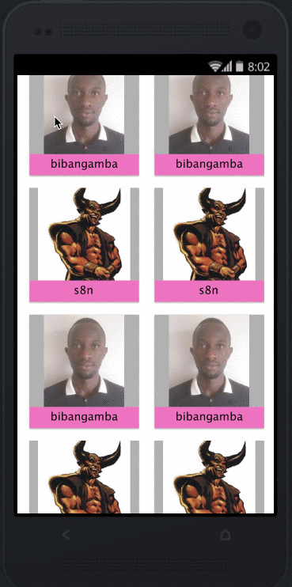

# GitHub Users mobile app

## Getting Started

Below are instructions to get the app good to run on your local machine.

### Prerequisites

* [Android Studio](https://developer.android.com/studio)
* [JDK](https://www.oracle.com/technetwork/java/javase/downloads/jdk8-downloads-2133151.html)
* [Git](https://git-scm.com/)

### Installing

* clone the repo : `git clone https://github.com/bibangamba/GitHubUsers.git` 
* import the project into android studio
* [create an android virtual device (AVD) and start it](https://developer.android.com/studio/run/managing-avds)
* [run the project](https://developer.android.com/training/basics/firstapp/running-app) you've imported above

## Running the tests

* In the terminal, run `./gradlew jacocoTestCoverage` to run tests and generate a coverage report

### Mock ups

### Demo

## Built With

* [Android Java](https://codelabs.developers.google.com/codelabs/build-your-first-android-app/) - Codelab on Java Android
* [Android Studio](https://developer.android.com/studio) - IDE
* [Retrofit](https://square.github.io/retrofit/) - HTTP Client for Android

## Author

*  [**Andrew Twijukye**](https://github.com/bibangamba)

## Acknowledgements
* [Joshua Mugisha](https://github.com/joshNic) for his feedback, advice, and guidance
* Jamillah Mayombwe for her mentorship, awesome resources, and enabling me achieve the best results
* [Andela](https://andela.com/) for the awesome opportunity and environment
